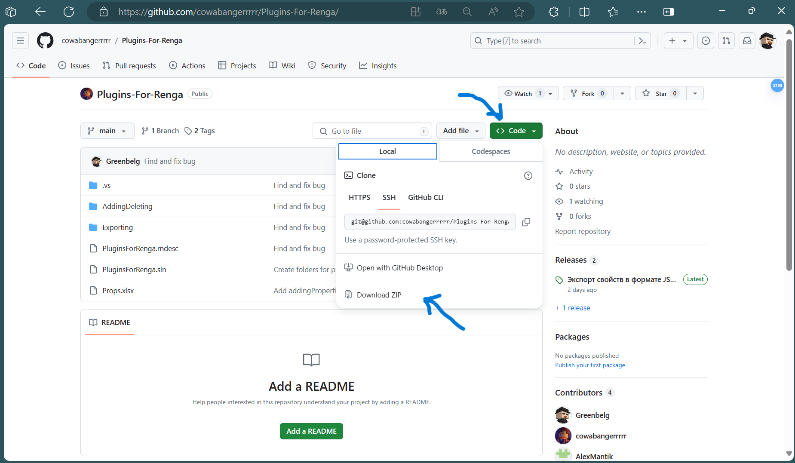
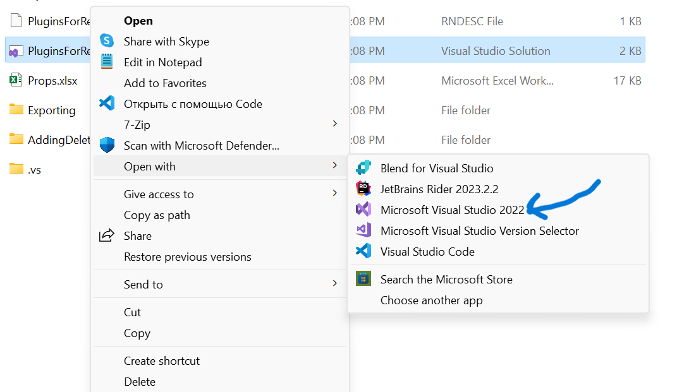

# Установка плагинов для Renga (Windows 11)
В данном руководстве приведена инструкция для установки плагинов Renga для операционной системы Widnows 11

## Подготовка
1. Установите [Visual Studio](https://visualstudio.microsoft.com/free-developer-offers/). Рекомендуем к просмотру следующее видео: [Hello World](https://ulearn.me/course/basicprogramming/Hello_world_70597ba7-f436-4301-816d-17dc34551bdb) - если хотите разобраться, как в нем работать
2. Скачайте [наш репозиторий](https://github.com/cowabangerrrrr/Plugins-For-Renga/) как zip-архив

3. Распакуйте скачанный архив в удобную для Вас папку
4. Откройте решение с помощью Visual Studio

5. В панели элементов сверху выберите:
    
    Build -> Build Solution (Собрать -> Собрать Решение)
6. После успешной сборки решения:
    
    * Переходим в папку с установленной Renga и создаем там папку ```Plugins``` (при ее отсутствии)
    * Создаем в ней две папки: ```AddingDeleting``` и ```Exporting```
    * Возвращаемся в папку с решением, которая была скачана из репозитория. Из нее необходимо скопировать содерждимое:
        
        * ```Exporting\bin\Release``` копируем в созданную папку ```Plugins\Exporting```
        * ```AddingDeleting\bin\Release``` копируем в создануую папку ```Plugins\AddingDeletins``` и меняем название файла ```PluginsForRenga.dll``` на ```AddingDeleting.dll```